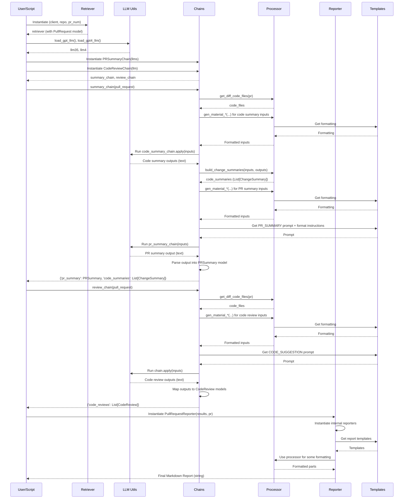

# Codedog: Architecture and Design Document

## 1. Overview

Codedog is designed as a modular system to retrieve pull request (PR) / merge request (MR) information from Git platforms (GitHub, GitLab), process the changes using Large Language Models (LLMs) via the LangChain framework, and generate structured reports (summaries, code reviews).

The core workflow involves:

1.  **Retrieval**: Fetching PR/MR metadata, changed files, diffs, and related issues using platform-specific APIs.
2.  **Processing**: Preparing the retrieved data (diff content, metadata) into suitable formats for LLM prompts.
3.  **LLM Interaction (Chains)**: Sending processed data to LLMs via predefined LangChain chains to generate summaries and reviews.
4.  **Reporting**: Formatting the LLM outputs into a user-friendly Markdown report.

The architecture emphasizes separation of concerns, allowing different platforms, LLMs, or reporting formats to be potentially integrated more easily.

## 2. Core Concepts & Data Models (`codedog/models/`)

Pydantic `BaseModel`s are used extensively to define the structure of data passed between different components. This ensures data consistency and leverages Pydantic's validation capabilities.

Key models include:

*   **`Repository`**: Represents a Git repository (source or target).
*   **`Commit`**: Represents a Git commit.
*   **`Issue`**: Represents a linked issue.
*   **`Blob`**: Represents file content at a specific commit.
*   **`DiffSegment` / `DiffContent`**: Represents parsed diff information using `unidiff` objects internally. Stores added/removed counts and content.
*   **`ChangeFile`**: Represents a single file changed within the PR/MR. Includes metadata like name, path, status (`ChangeStatus` enum: addition, modified, deletion, renaming, etc.), SHAs, URLs, and crucially, the `DiffContent`.
*   **`PullRequest`**: The central model representing the PR/MR. It aggregates information like title, body, URLs, and crucially contains lists of `ChangeFile` and related `Issue` objects, along with references to source/target `Repository` objects.
*   **`ChangeSummary`**: A simple model holding the summary generated by an LLM for a specific `ChangeFile`.
*   **`PRSummary`**: Holds the LLM-generated overall summary of the PR, including an overview text, a categorized `PRType` (feature, fix, etc.), and a list of `major_files` identified by the LLM.
*   **`CodeReview`**: Represents the LLM-generated review/suggestions for a specific `ChangeFile`.

These models provide a platform-agnostic representation of the core Git concepts needed for the review process.

## 3. Component Deep Dive

### 3.1. Retrievers (`codedog/retrievers/`)

*   **Purpose**: Abstract away the specifics of interacting with different Git hosting platforms (GitHub, GitLab). They fetch raw data and transform it into the project's internal Pydantic `models`.
*   **Design**:
    *   **`Retriever` (ABC)**: Defines the common interface (`retriever_type`, `pull_request`, `repository`, `source_repository`, `changed_files`, `get_blob`, `get_commit`).
    *   **`GithubRetriever`**: Implements `Retriever` using the `PyGithub` library.
        *   Initializes with a `Github` client, repo name/ID, and PR number.
        *   Maps `github.PullRequest`, `github.Repository`, `github.File`, `github.Issue`, etc., to `codedog` models (`_build_repository`, `_build_pull_request`, `_build_change_file`, `_build_issue`).
        *   Parses diff content (`_parse_and_build_diff_content`) using `unidiff` via `codedog.utils.diff_utils`.
        *   Extracts related issue numbers from PR title/body (`_parse_issue_numbers`).
    *   **`GitlabRetriever`**: Implements `Retriever` using the `python-gitlab` library.
        *   Initializes with a `Gitlab` client, project name/ID, and MR IID.
        *   Maps `gitlab.v4.objects.ProjectMergeRequest`, `gitlab.v4.objects.Project`, etc., to `codedog` models.
        *   Handles differences in API responses (e.g., fetching diffs via `mr.diffs.list()` and then getting full diffs).
        *   Similar logic for parsing diffs and issues.
*   **Interaction**: Instantiated at the start of the workflow with platform credentials and target PR details. Its primary output is the populated `PullRequest` model object.

### 3.2. Processors (`codedog/processors/`)

*   **Purpose**: To process and prepare data, primarily the `PullRequest` object and its contents, for consumption by the LLM chains and reporters.
*   **Design**:
    *   **`PullRequestProcessor`**: The main processor.
        *   `is_code_file`/`get_diff_code_files`: Filters `ChangeFile` objects to find relevant code files based on suffix and status (e.g., ignoring deleted files for review). Uses `SUPPORT_CODE_FILE_SUFFIX` and `SUFFIX_LANGUAGE_MAPPING`.
        *   `gen_material_*` methods (`gen_material_change_files`, `gen_material_code_summaries`, `gen_material_pr_metadata`): Formats lists of `ChangeFile`s, `ChangeSummary`s, and PR metadata into structured text strings suitable for inclusion in LLM prompts, using templates from `codedog/templates`.
        *   `build_change_summaries`: Maps the inputs and outputs of the code summary LLM chain back into `ChangeSummary` model objects.
        *   Uses `Localization` mixin to access language-specific templates.
*   **Interaction**: Takes the `PullRequest` object from the Retriever and lists of `ChangeSummary` or `CodeReview` objects from the Chains. Produces formatted strings for LLM inputs and structured data for Reporters.

### 3.3. Chains (`codedog/chains/`)

*   **Purpose**: Encapsulate the logic for interacting with LLMs using LangChain. Defines prompts, LLM calls, and parsing of LLM outputs.
*   **Design**:
    *   Follows a pattern of subclassing `langchain.chains.base.Chain` (though migrating to LCEL is a future possibility).
    *   Uses `LLMChain` internally to combine prompts and LLMs.
    *   **`PRSummaryChain` (`chains/pr_summary/base.py`)**:
        *   Orchestrates two `LLMChain` calls:
            1.  `code_summary_chain`: Summarizes individual code file diffs (using `CODE_SUMMARY_PROMPT`). Takes processed diff content as input. Uses `.apply` for batch processing.
            2.  `pr_summary_chain`: Summarizes the entire PR (using `PR_SUMMARY_PROMPT`). Takes processed PR metadata, file lists, and the *results* of the code summary chain as input.
        *   Uses `PydanticOutputParser` (wrapped in `OutputFixingParser`) to parse the PR summary LLM output directly into the `PRSummary` Pydantic model. Relies on format instructions injected into the prompt.
        *   `_process_*_input`: Methods prepare the dictionaries needed for `LLMChain.apply` or `LLMChain.__call__`.
        *   `_process_result`: Packages the final `PRSummary` object and the list of `ChangeSummary` objects.
    *   **`CodeReviewChain` (`chains/code_review/base.py`)**:
        *   Uses a single `LLMChain` (`code_review_chain`) with `CODE_REVIEW_PROMPT`.
        *   Takes processed diff content for each relevant file as input. Uses `.apply` for batch processing.
        *   `_process_result`: Maps LLM text outputs back to `CodeReview` objects, associating them with the original `ChangeFile`.
    *   **`Translate*Chain` Variants (`chains/code_review/translate_*.py`, `chains/pr_summary/translate_*.py`)**:
        *   Inherit from the base chains (`CodeReviewChain`, `PRSummaryChain`).
        *   Add an additional `translate_chain` (`LLMChain` with `TRANSLATE_PROMPT`).
        *   Override `_process_result` (and `_aprocess_result`) to call the base method *first* and then pass the generated summaries/reviews through the `translate_chain` using `.apply` or `.aapply`.
    *   **Prompts (`chains/.../prompts.py`)**: Define `PromptTemplate` objects, often importing base templates from `codedog/templates/grimoire_en.py` and sometimes injecting parser format instructions.
*   **Interaction**: Takes processed data from the `PullRequestProcessor`. Invokes LLMs via `langchain-openai` (or potentially others). Outputs structured data (`PRSummary`, `list[ChangeSummary]`, `list[CodeReview]`).

### 3.4. Templates (`codedog/templates/`) & Localization (`codedog/localization.py`)

*   **Purpose**: Centralize all user-facing text (report formats) and LLM prompt instructions. Support multiple languages.
*   **Design**:
    *   **`grimoire_*.py`**: Contain the core LLM prompt templates (e.g., `PR_SUMMARY`, `CODE_SUMMARY`, `CODE_SUGGESTION`, `TRANSLATE_PR_REVIEW`). These define the instructions given to the LLM.
    *   **`template_*.py`**: Contain f-string templates for formatting the final Markdown report (e.g., `REPORT_PR_REVIEW`, `REPORT_PR_SUMMARY`, `REPORT_CODE_REVIEW_SEGMENT`). Also includes mappings like `REPORT_PR_TYPE_DESC_MAPPING` and `MATERIAL_STATUS_HEADER_MAPPING`.
    *   **`Localization` Class**: A simple class used as a mixin. It holds dictionaries mapping language codes ("en", "cn") to the corresponding template and grimoire modules. Provides `.template` and `.grimoire` properties to access the correct language resources based on the instance's `language`.
*   **Interaction**:
    *   Grimoires are used by `chains/.../prompts.py` to create `PromptTemplate`s.
    *   Templates are used by `PullRequestProcessor` (for `gen_material_*`) and `actors/reporters` (for final report generation).
    *   The `Localization` mixin is used by Processors and Reporters to get language-specific text.

### 3.5. Actors / Reporters (`codedog/actors/reporters/`)

*   **Purpose**: Take the final processed data (LLM outputs packaged in models) and format it into the desired output format (currently Markdown).
*   **Design**:
    *   **`Reporter` (ABC)**: Defines the `report()` method interface.
    *   **`CodeReviewMarkdownReporter`**: Takes a list of `CodeReview` objects. Iterates through them, formatting each using `template.REPORT_CODE_REVIEW_SEGMENT`. Wraps the result in `template.REPORT_CODE_REVIEW`.
    *   **`PRSummaryMarkdownReporter`**: Takes `PRSummary`, `list[ChangeSummary]`, and `PullRequest`. Uses helper methods (`_generate_pr_overview`, `_generate_change_overivew`, `_generate_file_changes`) and templates (`template.REPORT_PR_SUMMARY`, `template.REPORT_PR_SUMMARY_OVERVIEW`, etc.) to build the summary part of the report. Leverages `PullRequestProcessor` for some formatting.
    *   **`PullRequestReporter`**: The main reporter. It orchestrates the other two reporters.
        *   Takes all final data: `PRSummary`, `list[ChangeSummary]`, `PullRequest`, `list[CodeReview]`, and optional telemetry data.
        *   Instantiates `PRSummaryMarkdownReporter` and `CodeReviewMarkdownReporter` internally.
        *   Calls their respective `report()` methods.
        *   Combines their outputs into the final overall report using `template.REPORT_PR_REVIEW`, adding headers, footers, and telemetry information.
*   **Interaction**: Consumes the output models from the Chains (`PRSummary`, `CodeReview`, etc.) and the original `PullRequest` data. Uses `templates` for formatting. Produces the final string output.

### 3.6. Utilities (`codedog/utils/`)

*   **Purpose**: Provide common helper functions used across different modules.
*   **Design**:
    *   **`langchain_utils.py`**:
        *   `load_gpt_llm()`, `load_gpt4_llm()`: Centralized functions to instantiate LangChain LLM objects (`ChatOpenAI` or `AzureChatOpenAI`). They read configuration from environment variables (`OPENAI_API_KEY`, `AZURE_OPENAI`, etc.). Use `@lru_cache` to avoid re-initializing models unnecessarily.
    *   **`diff_utils.py`**:
        *   `parse_diff()`, `parse_patch_file()`: Wrapper functions around the `unidiff` library to parse raw diff/patch strings into `unidiff.PatchSet` objects, simplifying usage in the retrievers.
*   **Interaction**: Used by Retrievers (diff parsing) and the main application logic/Quickstart (LLM loading).

## 4. Workflow / Execution Flow

A typical run (based on the Quickstart) follows these steps:

1.  **Initialization**:
    *   Load environment variables (API keys, etc.).
    *   Instantiate a platform client (e.g., `github.Github`).
    *   Instantiate the appropriate `Retriever` (e.g., `GithubRetriever`) with the client, repo, and PR number. The Retriever fetches initial data during init.
2.  **LLM & Chain Setup**:
    *   Load required LLMs using `codedog.utils.langchain_utils` (e.g., `load_gpt_llm`, `load_gpt4_llm`).
    *   Instantiate the required `Chain` objects (e.g., `PRSummaryChain.from_llm(...)`, `CodeReviewChain.from_llm(...)`), passing in the loaded LLMs.
3.  **Execute Chains**:
    *   Call the summary chain (e.g., `summary_chain({"pull_request": retriever.pull_request}, ...)`). This triggers the internal processing, LLM calls for code summaries, the main PR summary, and parsing. The result includes `pr_summary` (a `PRSummary` object) and `code_summaries` (a `list[ChangeSummary]`).
    *   Call the review chain (e.g., `review_chain({"pull_request": retriever.pull_request}, ...)`). This triggers LLM calls for each code file diff. The result includes `code_reviews` (a `list[CodeReview]`).
4.  **Generate Report**:
    *   Instantiate the main `PullRequestReporter` with the results from the chains (`pr_summary`, `code_summaries`, `code_reviews`) and the original `retriever.pull_request` object. Optionally pass telemetry data. Specify language if not default.
    *   Call `reporter.report()` to get the final formatted Markdown string.
5.  **Output**: Print or save the generated report string.



## 5. Configuration

*   Configuration is primarily handled via environment variables, loaded directly using `os.environ` (mainly in `codedog/utils/langchain_utils.py` for LLM keys/endpoints).
*   Platform tokens (GitHub/GitLab) are expected to be passed during client initialization, typically sourced from the environment by the calling script.

## 6. Design Choices & Considerations

*   **Modularity**: Separating retrieval, processing, LLM interaction, and reporting allows for easier extension or modification (e.g., adding Bitbucket support would primarily involve creating a new Retriever).
*   **Platform Abstraction**: The Pydantic models provide a common language internally, isolating most of the code from platform-specific details handled by the Retrievers.
*   **LangChain**: Leverages LangChain for abstracting LLM interactions, prompt management, output parsing, and chain composition. Using `LLMChain` provides a structured way to handle prompts and models.
*   **Pydantic**: Used for data validation, structure, and also leveraged by LangChain's `PydanticOutputParser` for reliable structured output from LLMs.
*   **Localization**: Built-in support for different languages via separate template files and the `Localization` mixin.
*   **Error Handling**: Currently somewhat basic; relies mainly on exceptions raised by underlying libraries (PyGithub, python-gitlab, LangChain). More robust handling could be added.
*   **Dependency Management**: Uses Poetry for clear dependency specification and environment management.

## 7. Future Improvements / TODOs

*   **LCEL Migration**: Update chains to use LangChain Expression Language (LCEL) instead of explicit `Chain` subclassing.
*   **Long Diff Handling**: Implement strategies (chunking, map-reduce) to handle very large file diffs that exceed LLM context limits.
*   **Enhanced Error Handling**: Add specific `try...except` blocks in retrievers and chains for better diagnostics.
*   **Configuration Flexibility**: Potentially add support for configuration files in addition to environment variables. Make Azure API version configurable.
*   **Extensibility**: Refine interfaces (e.g., `Retriever`, `Reporter`) to make adding new platforms or output formats even smoother.
*   **Testing**: Expand test coverage, potentially adding more integration tests.
*   **Resolve Pydantic v1 Shim Warning**: Investigate the lingering `LangChainDeprecationWarning` related to the pydantic_v1 shim import path.

``` 