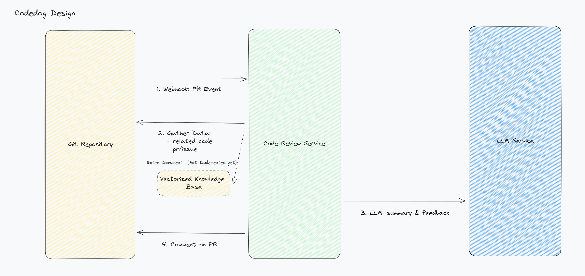

# 🐶 Codedog

[](https://github.com/Arcadia822/codedog/actions/workflows/flake8.yml)
[](https://github.com/Arcadia822/codedog/actions/workflows/test.yml)
[](https://github.com/Arcadia822/codedog/actions/workflows/test.yml)

Review your Github/Gitlab PR with ChatGPT



## Configuration

Codedog currently load config from environment variables.

settings:

| Config Name                   | Required | Default           | Description                             |
| ----------------------------- | -------- | ----------------- | --------------------------------------- |
| OPENAI_API_KEY                | Yes      |                   | Api Key for calling openai gpt api      |
| AZURE_OPENAI                  | No       |                   | Use azure openai gpt 3.5 if not blank   |
| AZURE_OPENAI_API_KEY          | No       |                   | Azure openai api key                    |
| AZURE_OPENAI_API_BASE         | No       |                   | Azure openai api base                   |
| AZURE_OPENAI_DEPLOYMENT_ID    | No       |                   | Azure openai deployment id for gpt 3.5  |
| AZURE_OPENAI_EMBEDDING_DEP_ID | No       |                   | Azure openai deployment id for embedding|

## Usage

### Github Example with GPT4

check `example/github_review.py`

### server

We have a demo server for you to try.

1. Run server with:

    ```bash
    poetry install --with http

    poetry run demoserver
    ```
## Development

```shell
poetry install --with dev, test, http
```
